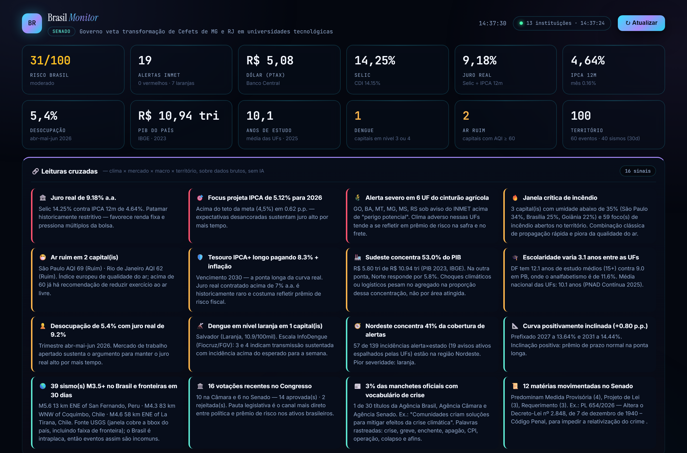
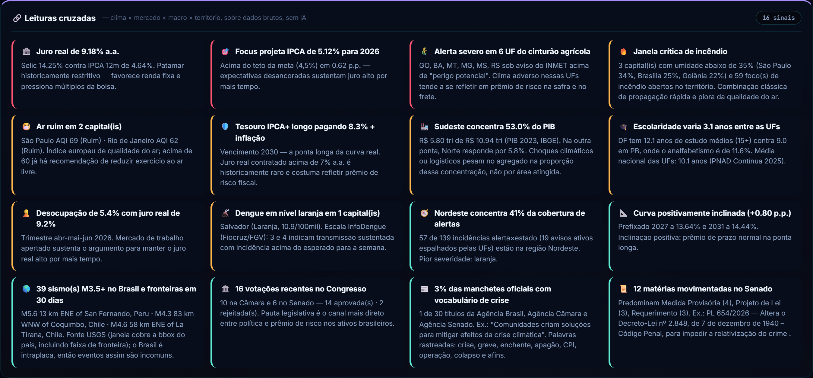
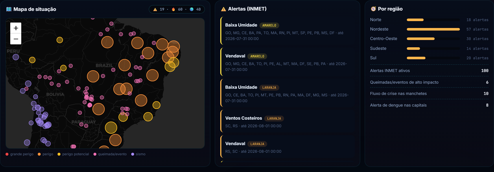
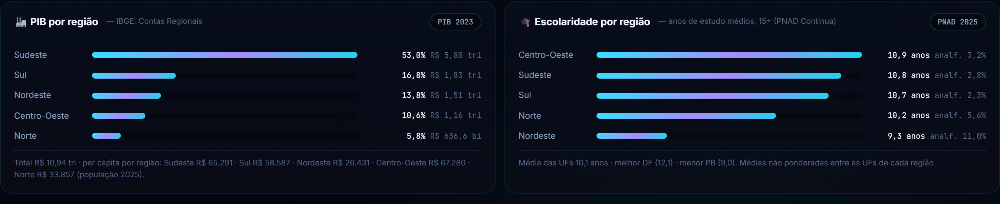
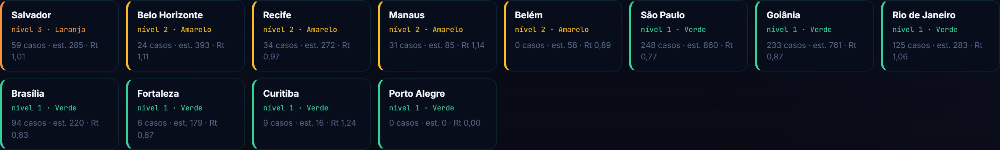

<div align="center">

# brasil-monitor

[](LICENSE)
[](package.json)
[](package.json)
[](test)
[](tsconfig.json)



</div>

---

Government open-data portals hand you raw numbers in isolation: an INMET alert here, a Selic reading there, a wildfire feed somewhere else, a PNAD table nobody opens. None of them tell you that severe weather over six agricultural states, alongside a 9% real interest rate and a Focus forecast above the target ceiling, is **a pattern worth noticing**.

Crossing those layers is the product. The sensors are raw material.

```bash
npx @daltonrpj/brasil-monitor serve      # the dashboard above, on localhost:4320
npx @daltonrpj/brasil-monitor snapshot   # the same data as plain text
```

No signup, no key, no config file. Every number on this page came from a live run.

## What it computes

**A 0-100 risk index** over six independently-capped components, so no single noisy source can spike it — and **seventeen deterministic cross-signals**, each one a plain rule reading two or more data layers and writing a sentence in Portuguese.



Not one of those readings involves a model. They are `if` statements over numbers, which is why they are always available, always the same for the same input, and auditable by reading [one file](src/cross-signals.ts).

## Seventeen cross-signals

| # | Reading | Layers crossed |
|---|---|---|
| 1 | Ex-post real interest rate | Selic × 12-month IPCA |
| 2 | Focus expectations vs. the target band | market survey × official target |
| 3 | Domestic risk-off/risk-on | FX × equities *(needs market data)* |
| 4 | Severe weather over the agricultural belt | INMET alerts × commodity prices |
| 5 | Critical fire-spread window | capital humidity × open wildfires |
| 6 | Degraded air quality | European AQI across 12 capitals |
| 7 | Regional concentration of alerts | alerts × IBGE regions |
| 8 | Implicit yield curve | short vs. long Tesouro prefixado |
| 9 | Long-end real yield | Tesouro IPCA+ term premium |
| 10 | Notable earthquakes | USGS over the Brazil bbox |
| 11 | Recent floor votes | Câmara × Senado, merged |
| 12 | GDP concentration by region | IBGE regional accounts × population |
| 13 | Educational spread between states | years of schooling × illiteracy rate |
| 14 | Unemployment against the real rate | PNAD Contínua × monetary policy |
| 15 | Dengue alert level | InfoDengue across the 12 capitals |
| 16 | Crisis vocabulary in official headlines | three state press agencies |
| 17 | Senate bills in motion | legislative pipeline by kind |

## The dashboard

Zero build step, zero framework — one HTML file served by `node:http`. Leaflet for the map, loaded from a CDN with free dark tiles; everything else is hand-written.








## The 13 institutions

| Institution | What it provides | Endpoint |
|---|---|---|
| **INMET** | Active severe-weather alerts | `apiprevmet3.inmet.gov.br` |
| **Banco Central** | Selic, IPCA, CDI, PTAX, debt/GDP, reserves, IBC-Br | `api.bcb.gov.br` (SGS) |
| **Banco Central** | Focus market expectations | `olinda.bcb.gov.br` |
| **IBGE** | News, population projection | `servicodados.ibge.gov.br` |
| **IBGE / SIDRA** | GDP per state, population per state, unemployment, years of schooling, illiteracy | `apisidra.ibge.gov.br` |
| **Tesouro Transparente** | Tesouro Direto rates (daily CSV) | `tesourotransparente.gov.br` |
| **Câmara dos Deputados** | Bills, votes, legislative agenda | `dadosabertos.camara.leg.br` |
| **Agência Câmara** | Newsroom feed | `camara.leg.br/noticias/rss` |
| **Senado Federal** | Bills in motion, floor votes | `legis.senado.leg.br/dadosabertos` |
| **Agência Senado** | Newsroom feed | `www12.senado.leg.br/noticias/rss` |
| **Agência Brasil (EBC)** | National newsroom feed | `agenciabrasil.ebc.com.br` |
| **NASA EONET** | Wildfires and natural events | `eonet.gsfc.nasa.gov` |
| **GDACS** | Global disaster alerts | `gdacs.org` |
| **USGS** | Earthquakes | `earthquake.usgs.gov` |
| **Open-Meteo** | Weather and air quality, 12 capitals | `open-meteo.com` |
| **InfoDengue** (Fiocruz/FGV) | Weekly dengue alert level per city | `info.dengue.mat.br` |
| **BrasilAPI** | Upcoming national holidays | `brasilapi.com.br` |

Every sensor fails independently. A dead INMET endpoint degrades that one section to an empty array; it never crashes the snapshot.

## The risk score

| Component | Formula | Caps at 100 when |
|---|---|---|
| Clima | `red×30 + orange×10 + total×2` | 4 severe alerts alone |
| Território | `red×25 + orange×6` | 4 red-tier disaster events |
| Câmbio | `max(0, dollarChange%) × 45` | dollar up 2.2%+ today |
| Bolsa | `max(0, -ibovChange%) × 40` | Ibovespa down 2.5%+ today |
| Notícias | `(crisisHeadlines / total) × 300` | a third of headlines match a crisis keyword |
| Saúde | `red×34 + orange×8` | 3 capitals at InfoDengue's red tier |

Components are averaged, and each is capped independently — a bad wildfire day contributes at most a sixth of the total. It takes several layers agreeing for the score to move a lot, which is what makes it a *composite* index rather than six separate alarms.

The first five carry the exact formulas of the private system this was extracted from. `Saúde` is an addition and only appears when dengue data is present, so omitting it reproduces the original index bit for bit. `Câmbio` and `Bolsa` need market data this package does not fetch — see below.

## Use it as a library

```bash
npm install @daltonrpj/brasil-monitor
```

```ts
import { BrasilMonitor } from '@daltonrpj/brasil-monitor';

const snapshot = await new BrasilMonitor().snapshot();

snapshot.risk;         // { score: 31, level: 'moderado', parts: [...] }
snapshot.cross;        // 16 deterministic cross-signal readings
snapshot.alerts;       // active INMET weather alerts
snapshot.indicators;   // Selic, IPCA, CDI, dollar, real rate, ...
snapshot.economy;      // GDP by state and by region, with per-capita
snapshot.education;    // years of schooling and illiteracy, by state and region
snapshot.unemployment; // PNAD Contínua rolling quarter
snapshot.news;         // Agência Brasil + Câmara + Senado, newest first
snapshot.senate;       // Senate bills in motion and floor votes
snapshot.congress;     // Câmara bills, votes and agenda
snapshot.dengue;       // InfoDengue alert level for 12 capitals
snapshot.tesouro;      // tradeable Tesouro Direto titles right now
snapshot.events;       // open wildfires/disasters (EONET + GDACS)
snapshot.quakes;       // earthquakes in the last 30 days (USGS)
snapshot.weather;      // 12 capitals: temperature, AQI, 3-day forecast
```

Sensor data is cached for 5 minutes (the 14MB Tesouro CSV for 6 hours — it updates once a business day). Pass `{ force: true }` to bypass it.

The reasoning layer is two pure functions, usable on your own data with no network at all:

```ts
import { crossSignals, computeRiskScore } from '@daltonrpj/brasil-monitor';

const signals = crossSignals({ alerts, weather, indicators, economy, education, dengue });
const risk = computeRiskScore({ alerts, events, headlines, dengue });
```

## Market data — bring your own

This package fetches no stock or currency quotes. Four numbers are the only market inputs the engine reads, and you supply them:

```ts
await monitor.snapshot({
  market: { dolarChangePct: 0.6, ibovChangePct: -0.5, soybeanChangePct: -1.2 },
});
```

Wire in a broker feed, a paid vendor, or whatever you already have — see [`examples/with-market.mjs`](examples/with-market.mjs). Quotes are left out on purpose: every source above is an official institution publishing its own data, and unofficial quote endpoints are a different category of dependency. That line is worth keeping visible rather than blurring.

The same goes for the live TV and webcam grid in the private system this was extracted from: it finds broadcasts by scraping YouTube's search pages, which is not a government open-data endpoint and does not belong behind the same promise.

## An AI brief on top (optional)

The cross-signals are rules and need no model. If you want a narrated paragraph, pipe a snapshot into your own:

```ts
const snapshot = await monitor.snapshot();
const brief = await yourChatFunction({
  messages: [
    { role: 'system', content: 'Resuma o quadro de risco do Brasil em 3 frases.' },
    { role: 'user', content: JSON.stringify({ risk: snapshot.risk, cross: snapshot.cross }) },
  ],
});
```

Pairs with [`@daltonrpj/atlas-agent-os`](https://github.com/daltonrpj/atlas-agent-os) if you want multi-provider failover for that call — or with anything else. This package has no opinion about which model you use, or whether you use one at all.

## Design notes

**Every fetch has a timeout and a fallback.** `getJson`/`getText` never throw: a timeout, a 4xx/5xx, or malformed JSON all resolve to `null`, and each sensor treats `null` as "this source is down right now". The nineteen-way `Promise.all` in `snapshot()` wraps each call in its own `withTimeout`, so one government API having a bad day costs that section, not the run.

**SIDRA requests are serialised.** IBGE's aggregate API answers any of these queries on its own but starts returning empty rows when five arrive at once alongside two dozen other requests. Rather than let three sensors silently blank out under load, calls to that host queue through a single chain and retry once — the failure mode looked exactly like a dead endpoint, which is the worst kind.

**SIDRA's missing-data marker is `".."`, not `null`.** `Number('..')` is `NaN`, but `Number('')` is `0` — a naive cast turns "not published yet" into a real-looking zero. Every read goes through `sidraValue`, which rejects the markers explicitly.

**Education tables need their classifications pinned.** PNAD Contínua's schooling tables are cut by sex and age group; without `c2/6794` (Total) and `c58/2795` (15+), SIDRA returns nothing but `".."` for every state and the sensor looks broken.

**The reasoning layer is pure.** No network, no side effects, no hidden state. That is what makes sixteen rules trivially unit-testable, and what lets you build your own dashboard, alerting pipeline or notebook on the same logic without touching the fetch layer.

## Development

```bash
npm install
npm run build
npm test          # 127 tests, no network required
npm start         # or: node dist/cli.js serve
```

Tests stub `fetch` or call nothing at all — the suite is fully offline and deterministic, including the clock-dependent paths (the Senate vote window, the epidemiological year, the risk-history throttle all take an injectable `now`). [`examples/snapshot.mjs`](examples/snapshot.mjs) hits the real APIs if you want to watch it live.

## License

MIT
